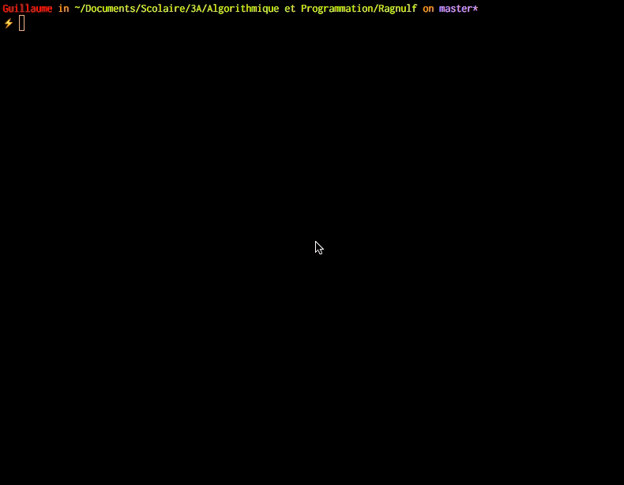

Ragnulf
=======

Résolution d'un Rubik's Cube par la méthode CFOP.

# TL;DR
```bash
python poqb.py --cube OGRBWYBGBGYYOYOWOWGRYOOOBGBRRYRBWWWRBWYGROWGRYBRGYWBOG
```



# Utilisation

## Dépendances

- Python 3
- Numpy (`pip install numpy`).

## Terminal
```bash
python poqb.py [--cube | -c] <cube> [--tuto] [--auto] [--speed | -s] <speed>  [--moves] [--colors]
```

- `--cube <cube>` (optionnel). Un cube à résoudre.

     Par défaut on résout `OGRBWYBGBGYYOYOWOWGRYOOOBGBRRYRBWWWRBWYGROWGRYBRGYWBOG`.

     Format : 54 couleurs parmis {Y, B, R, G, O, W} pour les 54 facettes.

- `-c<cube>` (optionnel). Voir `--cube`.
- `--tuto` (optionnel).

    Activer le mode tutoriel qui affiche la résoltution du cube pas à pas.

- `--auto` (optionnel).

    Avec `--tuto`, avancée automatique.

- `--speed <speed>` (optionnel).

    La vitesse d'avancée avec `--auto` en mouvements par secondes. Défaut 2/sec.

- `-s<speed>` (optionnel). Voir `--speed`.

- `--moves` (optionnel). Afficher la représentation des mouvements à effectuer sur le cube
    en plus du patron coloré.

- `--colors` (optionnel).

    Activer les couleurs ascii sous Windows, par exemple
    dans Git Bash.

## Module
```python
import poqb #import du fichier poqb.py
print(poqb.solve('OGRBWYBGBGYYOYOWOWGRYOOOBGBRRYRBWWWRBWYGROWGRYBRGYWBOG'))
#U2F2F'...
```

# Tests
Pour lancer les tests unitaires :
```python
python -m unittest discover -v
```

Ou, avec `green` (`pip3 install green`), pour avoir un peu de couleurs :
```python
green -vvv
#ou
green -vvv -r #avec coverage d'installé sur la machine
```
